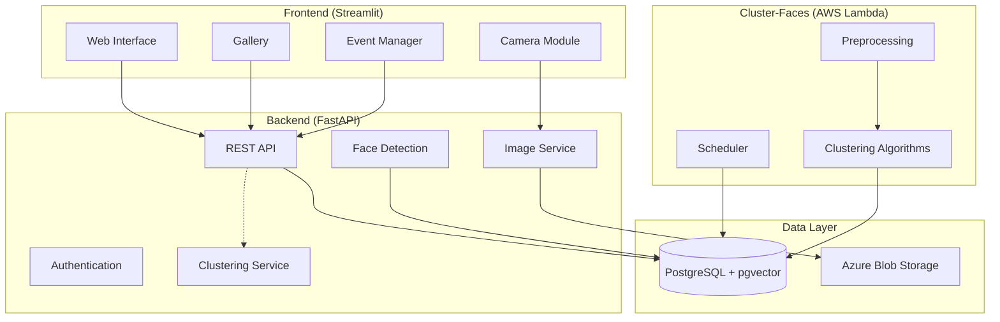

<a id="readme-top"></a>
<!-- PROJECT SHIELDS -->
[![Contributors][contributors-shield]][contributors-url]

<!-- PROJECT LOGO -->
<br />
<div align="center">
  <a href="https://github.com/shafiqninaba/kanta">
    
  </a>
<h2 align="center">Kanta</h2>

  <p align="center">
    <i>/kæntæ/</i>

Kanta, meaning lens in Malay, is an AI-powered collaborative event photo sharing platform that allows participants to capture, share, and organize photos with automatic face clustering.
    <br />
    <a href="https://github.com/shafiqninaba/kanta/issues/new?labels=bug&template=bug-report---.md">Report Bug</a>
    &middot;
    <a href="https://github.com/shafiqninaba/kanta/issues/new?labels=enhancement&template=feature-request---.md">Request Feature</a>
  </p>
</div>

<!-- TABLE OF CONTENTS -->
<details>
  <summary>Table of Contents</summary>
  <ol>
    <li>
      <a href="#built-with">Built With</a>
    </li>
    <li>
      <a href="#about-the-project">About The Project</a>
      <ul>
        <li><a href="#overview">Overview</a></li>
        <li><a href="#key-features">Key Features</a></li>
      </ul>
    </li>
    <li>
      <a href="#architecture">Architecture</a>
      <ul>
        <li><a href="#system-overview">System Overview</a></li>
        <li><a href="#backend-module">Backend Module</a></li>
        <li><a href="#cluster-faces-module">Cluster-Faces Module</a></li>
        <li><a href="#frontend-module">Frontend Module</a></li>
      </ul>
    </li>
    <li><a href="#demo">Demo</a></li>
    <li>
      <a href="#getting-started">Getting Started</a>
      <ul>
        <li><a href="#prerequisites">Prerequisites</a></li>
        <li><a href="#installation">Installation</a></li>
        <li><a href="#environment-setup">Environment Setup</a></li>
        <li><a href="#running-the-application">Running the Application</a></li>
      </ul>
    </li>
    <li><a href="#deployment">Deployment</a></li>
    <li><a href="#contact">Contact</a></li>
  </ol>
</details>

## Built With

* [![Python][Python-img]][Python-url]
* [![FastAPI][FastAPI-img]][FastAPI-url]
* [![Streamlit][streamlit-img]][streamlit-url]
* [![PostgreSQL][PostgreSQL-img]][PostgreSQL-url]
* [![Azure][Azure-img]][Azure-url]
* [![AWS][AWS-img]][AWS-url]
* [![Docker][Docker-img]][Docker-url]

<p align="right">(<a href="#readme-top">back to top</a>)</p>

***

<!-- ABOUT THE PROJECT -->
## About The Project

<div align="center">
  
</div>

### Overview

Kanta is a collaborative event photo sharing platform that transforms how people capture and organize memories at events. Participants can upload photos to a shared digital album, and the system automatically detects faces and groups photos by people using advanced face clustering algorithms.

The platform combines real-time photo sharing with intelligent organization, making it easy for event organizers and attendees to find and share the best moments from any gathering.

### Key Features

- **Event Management**: Create events with QR codes for easy participant access
- **Real-time Photo Upload**: Capture or upload photos directly through the web interface
- **Face Detection & Recognition**: Automatic detection of faces in uploaded images
- **Smart Clustering**: AI-powered face clustering to group photos by person
- **Gallery Organization**: Browse photos by event, date, or person
- **Similarity Search**: Find all photos containing similar faces
- **Disposable Camera Experience**: Nostalgic film camera interface with filters

<p align="right">(<a href="#readme-top">back to top</a>)</p>

***

## Architecture

### System Overview

Kanta follows a microservices architecture with three main modules working together:

<div align="center">
  
  <p><em>Figure 1: Kanta System Architecture</em></p>
</div>



### Backend Module

The backend is built with **FastAPI** and provides the core API functionality:

**Technology Stack:**
- FastAPI for REST API
- SQLAlchemy for ORM
- PostgreSQL with pgvector for database
- Azure Blob Storage for image storage
- Face Recognition library for face detection

**Key Components:**
- **Events API** (`backend/src/app/events/`): Event creation, management, and QR code generation
- **Images API** (`backend/src/app/images/`): Photo upload, face detection, and storage
- **Clusters API** (`backend/src/app/clusters/`): Face clustering queries and similarity search
- **Database Models**: SQLAlchemy models for events, images, and faces with vector embeddings

**Deployment:** Hosted on Azure Container Apps with automatic scaling

### Cluster-Faces Module

An independent clustering service that runs face clustering algorithms:

**Technology Stack:**
- Python with scikit-learn, HDBSCAN, and other ML libraries
- Hydra for configuration management
- Multiple clustering algorithms (DBSCAN, HDBSCAN, Chinese Whispers, etc.)

**Key Features:**
- **Multiple Algorithms**: DBSCAN, HDBSCAN, OPTICS, Affinity Propagation, Chinese Whispers, Agglomerative, and Birch clustering
- **Preprocessing**: PCA, UMAP, and normalization options
- **Automated Processing**: Runs every 5 minutes to cluster new faces
- **Event-Scoped**: Processes only active events to optimize performance

**Deployment:** Deployed as AWS Lambda function with scheduled triggers

### Frontend Module

A **Streamlit** web application providing an intuitive user interface:

**Key Pages:**
- **Home**: Overview and navigation
- **Events** (`pages/01_Events.py`): Event creation, editing, and QR code management
- **Camera** (`pages/02_Camera.py`): Photo capture with disposable camera experience and filters
- **Gallery** (`pages/03_Gallery.py`): Browse and filter photos by various criteria
- **People** (`pages/04_People.py`): View face clusters and find photos by person

**Features:**
- Responsive design with custom CSS
- Real-time photo upload with progress tracking
- Image filters and processing
- Event selection and management
- Admin controls for event deletion

<p align="right">(<a href="#readme-top">back to top</a>)</p>

***

## Demo

### Event Creation and QR Code Generation

<div align="center">
  
  <p><em>Figure 2: Creating an event and generating QR codes for participant access</em></p>
</div>

### Photo Upload and Face Detection

<div align="center">
  
  <p><em>Figure 3: Uploading photos with automatic face detection</em></p>
</div>

### Face Clustering and Gallery

<div align="center">
  
  <p><em>Figure 4: Automatic face clustering and gallery organization</em></p>
</div>

<p align="right">(<a href="#readme-top">back to top</a>)</p>

***

## Getting Started

### Prerequisites

- **Docker** and **Docker Compose**
- **Python 3.12+** (for local development)
- **PostgreSQL 15+** with pgvector extension
- **Azure Storage Account**
- **AWS Account** (for Lambda deployment)

### Installation

1. Clone the repository:
```bash
git clone https://github.com/shafiqninaba/kanta.git
cd kanta
```

### Environment Setup

Create a `.env` file in the root directory with the following variables:

```ini
AZURE_STORAGE_CONNECTION_STRING="DefaultEndpointsProtocol=https;AccountName=<your-account-name>;AccountKey=<your-account-key>;EndpointSuffix=core.windows.net"

POSTGRES_SERVER=<your_postgres_server>
POSTGRES_USER=<your_postgres_user>
POSTGRES_PASSWORD=<your_postgres_password>
POSTGRES_DB=<your_postgres_db>
POSTGRES_PORT=<your_postgres_port>
```

### Running the Application

#### Using Docker Compose (Recommended)

1. Build and start all services:
```bash
docker-compose up --build
```

2. Access the application:
   - **Frontend**: http://localhost:8501
   - **Backend API**: http://localhost:8000
   - **API Documentation**: http://localhost:8000/docs

#### Local Development

1. **Backend**:
```bash
cd backend
uv sync
uv run fastapi dev src/app/main.py --host 0.0.0.0 --port 8000
```

2. **Frontend**:
```bash
cd frontend
uv sync
uv run streamlit run Home.py --server.port 8501
```

3. **Clustering Service**:
```bash
cd cluster-faces
uv sync
uv run main.py
```

<p align="right">(<a href="#readme-top">back to top</a>)</p>

***

## Deployment

### Azure Container Apps (Backend & Frontend)

The backend and frontend are deployed on Azure Container Apps for automatic scaling and managed hosting.

### AWS Lambda (Clustering)

The face clustering service runs on AWS Lambda with EventBridge scheduling for periodic execution.

<p align="right">(<a href="#readme-top">back to top</a>)</p>

***

## Contact

<a href="https://github.com/shafiqninaba/kanta/graphs/contributors">
  
</a>

Shafiq Ninaba | shafiqninaba@gmail.com | [LinkedIn](https://linkedin.com/in/shafiq-ninaba)

Zack Low | lowrenhwa88@gmail.com | [LinkedIn](https://www.linkedin.com/in/ren-hwa-low-855080224/)

<p align="right">(<a href="#readme-top">back to top</a>)</p>

<!-- MARKDOWN LINKS & IMAGES -->
[contributors-shield]: https://img.shields.io/github/contributors/shafiqninaba/kanta.svg?style=for-the-badge
[contributors-url]: https://github.com/shafiqninaba/kanta/graphs/contributors
[Python-img]: https://img.shields.io/badge/python-3670A0?style=for-the-badge&logo=python&logoColor=ffdd54
[Python-url]: https://www.python.org/
[FastAPI-img]: https://img.shields.io/badge/FastAPI-005571?style=for-the-badge&logo=fastapi
[FastAPI-url]: https://fastapi.tiangolo.com/
[streamlit-img]: https://img.shields.io/badge/-Streamlit-FF4B4B?style=for-the-badge&logo=streamlit&logoColor=white
[streamlit-url]: https://streamlit.io/
[PostgreSQL-img]: https://img.shields.io/badge/postgresql-4169e1?style=for-the-badge&logo=postgresql&logoColor=white
[PostgreSQL-url]: https://www.postgresql.org/
[Azure-img]: https://img.shields.io/badge/microsoft%20azure-0089D0?style=for-the-badge&logo=microsoft-azure&logoColor=white
[Azure-url]: https://azure.microsoft.com/
[AWS-img]: https://img.shields.io/badge/AWS-%23FF9900.svg?style=for-the-badge&logo=amazon-aws&logoColor=white
[AWS-url]: https://aws.amazon.com/
[Docker-img]: https://img.shields.io/badge/docker-%230db7ed.svg?style=for-the-badge&logo=docker&logoColor=white
[Docker-url]: https://www.docker.com/